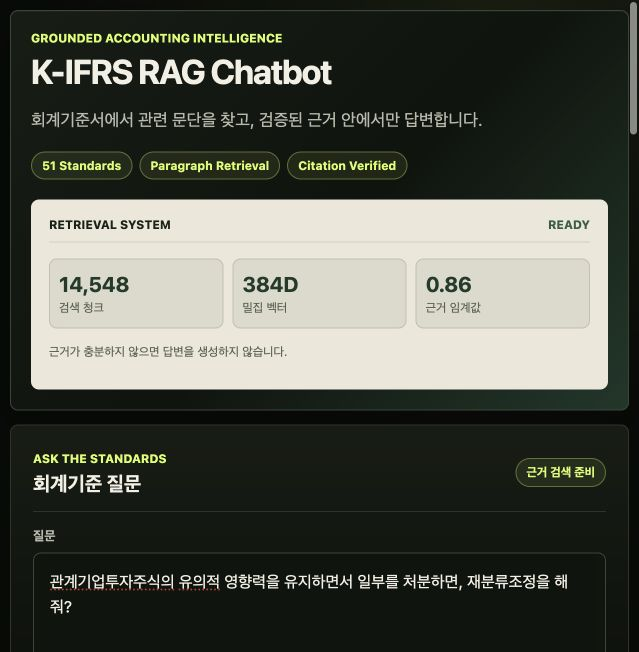
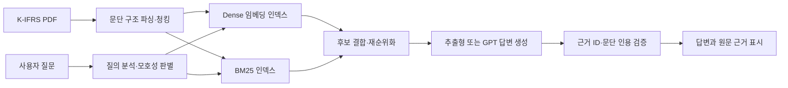
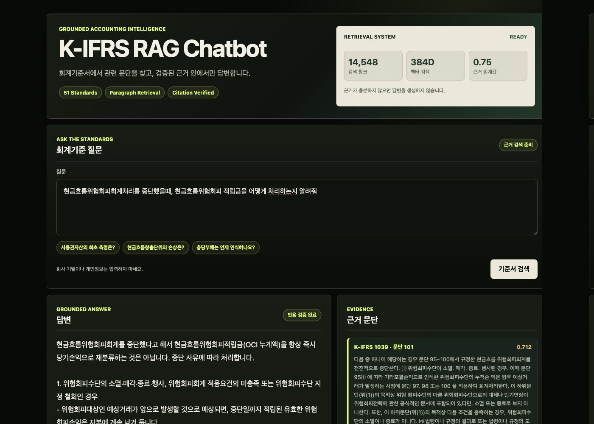

# K-IFRS RAG

K-IFRS 회계기준서에서 관련 문단을 검색하고, 해당 근거를 바탕으로 답변하는 RAG 챗봇입니다.

[](https://codespaces.new/khk0331/K-IFRS_RAG_CHATBOT?quickstart=1)



## 시스템 구성



실제 데이터 기준 51개 기준서, 14,548개 검색 청크와 384차원 다국어 임베딩을 사용합니다. GPT 하네스는 질문을 검색 질의로 분해하고, 모호한 질문에는 추가 정보를 요청하며, 검색 후보 중 선택한 문단만 답변 근거로 반환합니다.

## 실제 K-IFRS + GPT 모드 구현 결과

아래 화면은 합성 데모가 아니라 이용 권한이 있는 K-IFRS PDF 51개를 파싱·인덱싱한 실제 모드에서 실행한 결과입니다. `현금흐름위험회피 회계처리를 중단했을 때 적립금을 어떻게 처리하는지` 질문에 대해 답변과 함께 K-IFRS 제1039호 문단 101 등 검색된 근거 원문을 표시합니다.



실제 모드는 다음 전 과정을 구현하고 로컬에서 실행했습니다.

- **문서 처리:** PDF 무결성 검사 후 기준서·문단·페이지 정보를 보존해 14,548개 청크 생성
- **검색:** `multilingual-e5-small` 384차원 의미 검색과 BM25 키워드 검색을 결합하고 회계 논점에 맞게 재순위화
- **GPT 제어:** 저비용 모델이 질문을 검색 질의로 분해하고, 답변 모델에는 검색된 후보와 근거 ID만 전달
- **근거 검증:** 모델이 반환한 근거 ID가 실제 후보에 존재할 때만 기준서 번호·문단·원문을 노출
- **실패 통제:** 질문이 모호하거나 근거 점수가 낮고, 인용 검증 또는 비용 한도를 통과하지 못하면 답변 보류

구현은 [PDF 파서](scripts/ingest_pdfs.py), [인덱스 생성기](scripts/build_index.py), [하이브리드 검색·재순위화](src/kifrs_rag/hybrid_retrieval.py), [GPT 하네스](src/kifrs_rag/openai_harness.py), [API와 인용 검증](src/kifrs_rag/api.py)에서 확인할 수 있습니다. 공개 저장소에서는 저작권과 보안을 위해 K-IFRS 원문·파생 인덱스·API 키만 제외했으며, 실제 모드 실행 코드는 포함합니다.

## API 키 없는 공개 데모

README 상단의 **Open in GitHub Codespaces**를 누르고 Codespace 생성을 선택하면 의존성이 설치되고 데모 서버가 자동 실행됩니다. 포트 `8000` 알림에서 **Open in Browser**를 누르면 챗봇을 사용할 수 있습니다. 별도의 K-IFRS PDF나 OpenAI API 키는 필요하지 않습니다.

공개 데모에는 저작권 문제가 없는 합성 회계 문단만 포함됩니다. 실제 K-IFRS 원문을 재현한 자료가 아니며 회계 판단에 사용할 수 없습니다. 다만 실제 모드와 동일한 질문 검증, 후보 검색, 점수 임계값, 근거 선택, 인용 검증 및 답변 보류 흐름을 체험할 수 있습니다.

추천 질문:

- `사용권자산의 최초 측정은?`
- `현금흐름창출단위의 손상은?`
- `충당부채는 언제 인식하나요?`
- `화성 탐사선의 연료는?` — 회계 근거가 없어 답변을 보류하는 사례

| 구분 | 공개 데모 | 실제 K-IFRS 모드 |
|---|---|---|
| 문서 | 합성 문단 8개 | 이용 권한이 있는 K-IFRS PDF 51개 |
| 검색 | 로컬 벡터 유사도 + BM25 + 제목 재순위화 | multilingual-e5 임베딩 + BM25 + 회계 논점 재순위화 |
| 답변 | 근거 원문 추출 | GPT 기반 근거 제한 답변 또는 추출형 답변 |
| API 키 | 불필요 | GPT 사용 시 필요 |
| 목적 | 파이프라인과 UI 체험 | 실제 기준서 검색 및 답변 생성 |

## 기술 선택과 처리 과정

### 1. 문단 구조 파싱과 청킹

PDF의 페이지 텍스트를 단순한 고정 길이 문자열로 자르면 기준서 번호와 문단 번호가 답변 근거에서 분리될 수 있습니다. 이 프로젝트는 문단 번호를 먼저 식별하고 긴 문단만 겹침을 두어 분할합니다. 각 청크에는 기준서 ID, 문단 ID, 제목, 개정 정보, 원본 PDF 페이지를 메타데이터로 보존합니다. 이 구조는 검색 결과를 사용자에게 정확한 문단 단위로 되돌려 주고, 존재하지 않는 인용을 서버에서 거부하기 위해 필요합니다.

### 2. 임베딩 검색: 표현이 달라도 같은 의미 찾기

실제 모드는 `intfloat/multilingual-e5-small`로 질문과 문단을 384차원 벡터로 변환합니다. 임베딩은 `현금흐름창출단위 손상`과 `CGU의 회수가능액 검토`처럼 단어가 완전히 일치하지 않아도 의미가 가까운 문단을 후보로 찾기 위해 사용합니다. 질의에는 `query:` 접두어, 문단에는 `passage:` 접두어를 적용하고 정규화된 벡터의 코사인 유사도를 계산합니다. 문서 벡터는 미리 생성해 로컬 인덱스에 저장하고 질문 벡터만 요청 시 계산합니다.

공개 데모는 Codespaces 시작 시간과 메모리 사용량을 줄이기 위해 외부 모델을 내려받지 않습니다. 대신 한글 단어와 글자 단위 토큰으로 만든 로컬 벡터 유사도를 사용합니다. 따라서 데모는 검색 흐름을 보여주지만 실제 임베딩의 의미 검색 성능을 대표하지 않습니다.

### 3. BM25 검색: 정확한 회계 용어와 문단 표현 찾기

BM25는 키워드 기반 검색 알고리즘입니다. 문서 안에서 자주 등장하지만 전체 문서에서는 희소한 단어에 높은 가중치를 주고, 문서 길이와 단어 반복 횟수를 보정합니다. 기준서 번호, `공정가치위험회피`, `현금흐름창출단위`처럼 정확한 용어 일치가 중요한 회계 질문에서는 임베딩만 사용하는 것보다 BM25가 강합니다. 반대로 표현이 달라지면 키워드 검색의 재현율이 낮아질 수 있어 임베딩과 함께 사용합니다.

### 4. 하이브리드 결합과 재순위화

실제 모드는 임베딩 검색 순위와 BM25 검색 순위를 Reciprocal Rank Fusion 방식으로 결합합니다. 이후 질문에서 식별한 회계 주제, 최초·후속 측정 의도, 기준서 범위와 특수 산업 용어를 반영해 후보 점수를 다시 계산합니다. 예를 들어 `사용권자산의 후속 측정` 질문에는 리스 기준서의 감가상각·손상·재측정 문단을 우대하고, 질문에 없는 농림어업이나 보험 문단은 감점합니다. 이 단계는 단어가 일부 겹친다는 이유만으로 관련 없는 기준서가 최상위에 오는 문제를 줄입니다.

공개 데모는 로컬 벡터 점수 58%, BM25 정규화 점수 32%에 질문과 문단 제목의 토큰 일치 보너스를 더하는 경량 재순위화를 사용합니다. 점수가 임계값보다 낮으면 생성 단계로 넘기지 않고 `insufficient_evidence`를 반환합니다.

### 5. GPT 질의 계획과 답변 생성

GPT는 검색을 대체하지 않고 검색과 답변을 제어하는 하네스로 사용합니다. 비용이 낮은 `gpt-5-nano`가 먼저 질문을 회계 논점과 최대 네 개의 검색 질의로 분해합니다. 자체 건설자산과 고객 건설계약처럼 전제에 따라 회계처리가 달라지면 임의로 답하지 않고 추가 정보를 요청합니다. 이후 넓게 검색한 후보를 답변 모델에 `E1`, `E2` 형식의 근거 ID와 함께 전달합니다.

답변 모델은 선택한 근거 ID를 구조화된 JSON으로 반환해야 합니다. 서버는 답변이 비어 있지 않은지, 하나 이상의 근거를 선택했는지, 모든 ID가 실제 검색 후보에 존재하는지를 검증합니다. 검증을 통과한 문단만 화면에 기준서 번호·문단·원문으로 표시합니다. GPT는 자연스러운 설명과 질문의 모호성 판단에 유용하지만, 검색되지 않은 지식을 섞을 수 있으므로 최종 인용 권한은 모델이 아니라 서버가 가집니다.

### 6. 비용과 보안 통제

OpenAI 사용량은 Git에서 제외된 로컬 원장에 누적하며 `KIFRS_OPENAI_BUDGET_USD` 한도를 넘기기 전에 추가 호출을 차단합니다. API 키는 환경변수로만 전달하고 파일이나 브라우저에 저장하지 않습니다. 질문의 이메일, 전화번호, 주민등록번호 및 카드번호 형식은 마스킹하며, 프롬프트 탈취 표현과 문서 내부의 명령문은 실행하지 않습니다. 실제 PDF, 추출 원문과 벡터 인덱스도 저장소 및 Docker 이미지에서 제외합니다.

## 빠른 시작

Python 3.11 이상이 필요합니다.

```bash
python -m venv .venv
source .venv/bin/activate
pip install -e .
uvicorn kifrs_rag.api:app --reload
```

서버 실행 후 API 문서는 `http://127.0.0.1:8000/docs`에서 확인할 수 있습니다. 기본 설정은 저작권 문제가 없는 합성 샘플 문서를 사용합니다.

챗봇 화면은 `http://127.0.0.1:8000/`에서 열 수 있으며 모바일 화면에도 맞게 배치됩니다.

테스트는 추가 패키지 없이 실행할 수 있습니다.

```bash
PYTHONPATH=src python -m unittest discover -s tests -v
```

검색 품질과 답변 보류 성능은 다음 명령으로 확인할 수 있습니다.

```bash
PYTHONPATH=src python scripts/evaluate.py
```

결과에는 Recall@K, MRR, 답변 가능 여부 정확도가 포함됩니다.

## Docker 실행

```bash
docker build -t kifrs-rag .
docker run --rm -p 8000:8000 kifrs-rag
```

컨테이너에는 합성 샘플만 포함됩니다. 실제 PDF와 벡터 인덱스는 이미지에 넣지 않고 실행 환경에서 읽기 전용 볼륨으로 연결해야 합니다.

## K-IFRS PDF 등록

한국회계기준원에서 직접 내려받은 PDF를 `data/private/pdfs/`에 저장한 후 다음 명령을 실행합니다.

```bash
PYTHONPATH=src python scripts/audit_pdfs.py data/private/pdfs \
  --output data/private/pdf_audit.json

PYTHONPATH=src python scripts/ingest_pdfs.py data/private/pdfs
```

첫 번째 명령은 파일 손상, 암호화, 중복 및 텍스트 추출 가능 여부를 검사합니다. 두 번째 명령은 기준서와 문단 구조를 보존한 `data/private/standards.json`을 생성합니다.

실제 문서로 API를 실행하려면 환경변수를 지정합니다.

```bash
pip install -e '.[semantic]'
PYTHONPATH=src python scripts/build_index.py

KIFRS_RETRIEVER=hybrid \
KIFRS_INDEX_PATH=data/index/e5-small \
uvicorn kifrs_rag.api:app --reload
```

기본 임베딩 모델은 `intfloat/multilingual-e5-small`이며 질의와 문서를 구분해 인코딩합니다. 실제 문서 모드는 Dense 임베딩과 BM25 후보를 결합한 뒤 기준서 주제, 질문 의도 및 특수 적용범위를 반영해 재순위화합니다. 하이브리드 점수가 기본 임계값 `0.75`보다 낮으면 답변을 보류합니다.

하이브리드 검색 평가 명령:

```bash
PYTHONPATH=src python scripts/evaluate.py \
  --retriever hybrid \
  --evals evals/dense_smoke.jsonl \
  --top-k 5 \
  --min-score 0.75
```

주요 기준서 질의와 무관 질문 보류를 포함한 회귀 평가:

```bash
PYTHONPATH=src python scripts/evaluate.py \
  --retriever hybrid \
  --evals evals/hybrid_regression.jsonl \
  --top-k 3 \
  --min-score 0.75
```

`data/private/`의 PDF·추출 원문·검사 결과와 `data/index/`의 벡터 인덱스는 Git에 포함되지 않습니다.

## 답변 생성 모델 연결

기본 `extractive` 모드는 가장 관련도 높은 근거 원문을 그대로 반환하므로 외부 API 키가 필요하지 않습니다. OpenAI 호환 Chat Completions API를 사용하려면 다음 환경변수를 설정합니다.

```bash
KIFRS_GENERATOR=openai_compatible \
KIFRS_LLM_BASE_URL=https://provider.example/v1 \
KIFRS_LLM_MODEL=model-name \
KIFRS_LLM_API_KEY=replace-me \
uvicorn kifrs_rag.api:app --reload
```

생성 모델에는 검색된 근거마다 `E1`, `E2` 형식의 ID가 부여됩니다. 모델은 답변과 사용한 근거 ID를 JSON으로 반환해야 하며, 서버는 다음 조건을 모두 확인한 후에만 답변을 제공합니다.

- 답변이 비어 있지 않음
- 하나 이상의 근거가 지정됨
- 모든 근거 ID가 실제 검색 결과에 존재함
- 형식 오류가 있으면 한 번만 수정 요청
- 재검증 실패 시 `validation_failed` 반환

외부 생성 모델을 사용하면 질문과 검색된 기준서 일부가 해당 제공자에게 전송됩니다. 문서 이용 권한과 제공자의 데이터 보관·학습 정책을 확인한 후 활성화해야 합니다.

### GPT 질의 계획·근거 선택

GPT가 질문을 분해하고 광범위 검색 후보 중 직접 관련된 문단을 선택한 후 답변하도록 실행할 수 있습니다.

```bash
OPENAI_API_KEY=replace-me \
KIFRS_RETRIEVER=hybrid \
KIFRS_HARNESS=openai \
KIFRS_OPENAI_BUDGET_USD=3.0 \
uvicorn kifrs_rag.api:app --reload
```

기본 플래너는 `gpt-5-nano`, 답변 모델은 `gpt-5.6-luna`입니다. 누적 예상비용이 설정된 한도에 도달하면 추가 호출을 차단합니다. 사용량은 Git에서 제외된 `data/private/openai_usage.json`에 기록하며 API 키는 저장하지 않습니다.

플래너는 자체 건설자산과 고객 건설계약처럼 질문만으로 회계처리를 확정할 수 없는 경우 바로 답하지 않고 추가 정보를 요청합니다. 답변은 검색 근거에서 선택한 문단만 별도 인용하며, 제공된 PDF에 현행 적용 기준서가 없으면 자료 범위를 명시합니다.

## 주요 기능

- 자연어로 K-IFRS 관련 질문 입력
- 질문과 관련된 기준서 문단 검색
- 검색된 근거에 한정한 한국어 답변 생성
- 기준서 번호, 문단 번호 및 근거 원문 표시
- 근거가 부족한 경우 답변 보류
- 문서에 포함된 악성 지시문과 잘못된 인용 차단

## 동작 방식

```text
K-IFRS 문서 → 파싱 및 청킹 → 임베딩·BM25 검색 준비
사용자 질문 → Dense·BM25 후보 검색 → 재순위화 → 답변 생성 → 인용 검증
```

문서는 기준서, 장·절, 문단 구조를 최대한 유지해 처리합니다. 각 검색 결과에는 기준서 번호, 문단 번호, 제목, 시행일, 출처 등의 메타데이터가 포함됩니다.

## 답변 원칙

- 검색된 기준서 내용에 없는 사항은 추측하지 않습니다.
- 답변의 주요 내용에는 확인 가능한 기준서 문단을 제시합니다.
- 관련성이 낮거나 충분한 근거를 찾지 못하면 답변을 생성하지 않습니다.
- 기준서 원문과 모델의 설명을 구분합니다.
- 문서 안의 지시문은 시스템 명령으로 실행하지 않습니다.

## API

### `POST /v1/query`

요청 예시:

```json
{
  "question": "리스의 사용권자산은 최초에 어떻게 측정하나요?"
}
```

응답 예시:

```json
{
  "status": "answered",
  "answer": "검색된 기준서에 근거한 답변",
  "citations": [
    {
      "standard_id": "K-IFRS 1116",
      "paragraph_id": "23",
      "quote": "근거 원문",
      "score": 0.91
    }
  ],
  "trace_id": "uuid"
}
```

충분한 근거가 없으면 `status`가 `insufficient_evidence`로 반환됩니다.

## 데이터 및 보안

- 이용 권한이 확인된 기준서만 등록해야 합니다.
- 실제 K-IFRS 원문은 이용·재배포 권한을 확인한 후 사용해야 합니다.
- API 키와 비밀정보는 환경변수로 관리합니다.
- 질문에 포함된 개인정보와 회사 기밀은 외부 모델 전송 전에 제거하거나 마스킹해야 합니다.
- 질문 원문은 기본적으로 영구 저장하지 않으며 로그에는 필요한 최소 정보만 기록합니다.
- 이메일, 휴대전화번호, 주민등록번호 및 카드번호 형식은 질문 처리 전에 마스킹합니다.
- 응답에는 콘텐츠 스니핑·프레임 삽입 방지와 최소 권한 브라우저 정책 헤더를 적용합니다.
- 자동 테스트, 검색 품질 기준선, 컴파일 및 컨테이너 빌드를 GitHub Actions에서 확인합니다.
- 운영 환경에서는 TLS, 저장 데이터 암호화, 접근통제 및 감사 로그가 필요합니다.

## 제한사항

- 답변은 검색된 문서의 범위와 품질에 따라 달라질 수 있습니다.
- 개정된 기준서가 인덱스에 반영되지 않았다면 최신 내용을 제공하지 못할 수 있습니다.
- 이 서비스의 답변은 회계·감사·법률 자문을 대체하지 않습니다.
- 중요한 판단에는 최신 공식 기준서와 전문가 검토가 필요합니다.

## 라이선스 및 저작권

애플리케이션 코드의 라이선스와 기준서 원문의 이용 권한은 별개입니다. K-IFRS 원문을 복제, 가공, 임베딩 또는 배포하기 전에 해당 문서의 이용 조건을 확인해야 합니다.
